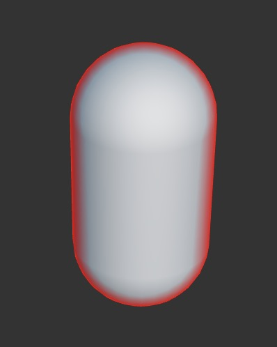
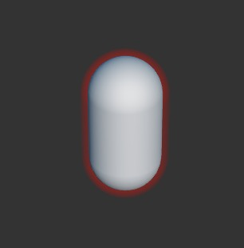
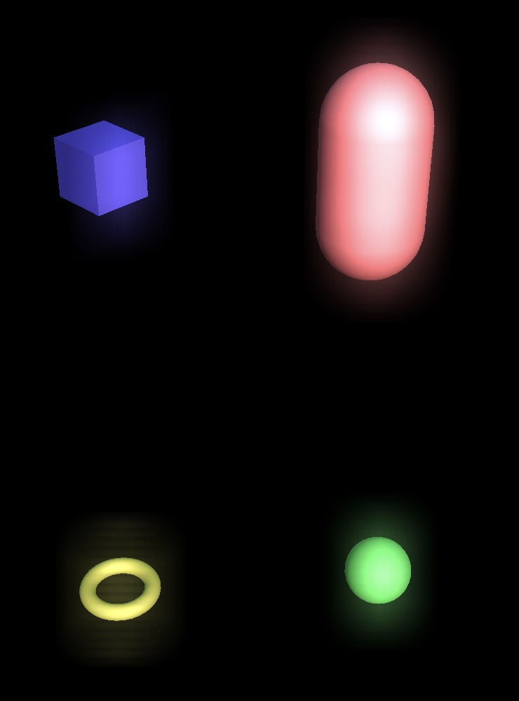
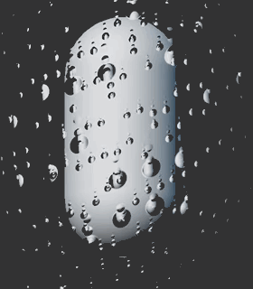
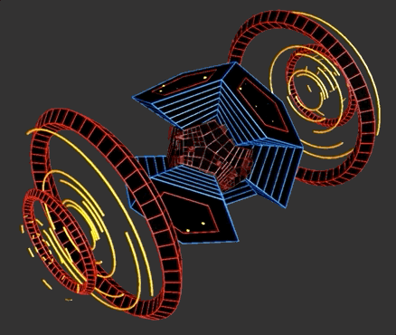
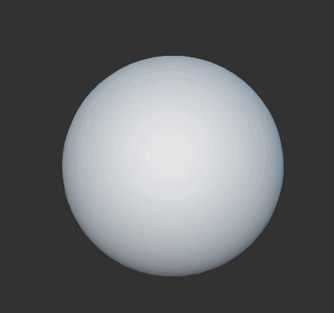

# Effect Case

## 环境

使用 Cocos Creator 来实现的效果

## 列表

* 内发光 (assets/caseInnerGrow)

* 外发光 (assets/caseOutLine)

* Bloom辉光 (assets/caseBloom) (Derepcated)

* 玻璃上的雨滴

* Bloom辉光2 (assets/caseBloom)

* Dissolve (assets/caseDissolve)

* 合批支持多纹理 MultiTex (assets/caseMultiTex)

* Decals 贴花 (assets/caseDecals/method2)

